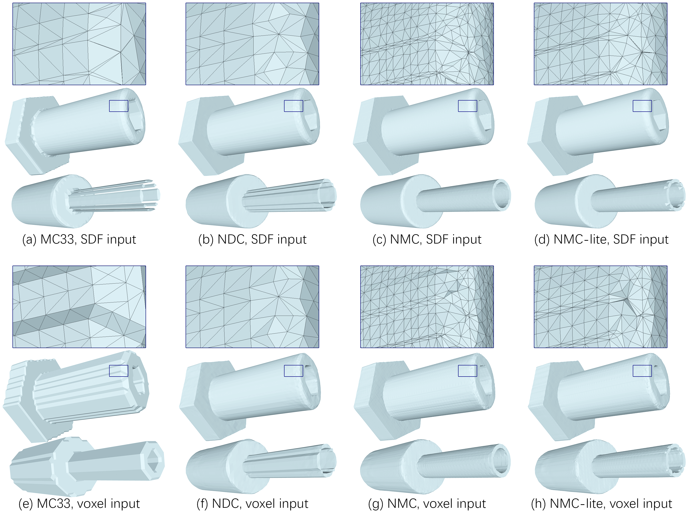

# NDC
PyTorch implementation for paper [Neural Dual Contouring](https://arxiv.org/abs/2202.01999), [Zhiqin Chen](https://czq142857.github.io/), [Andrea Tagliasacchi](https://taiya.github.io/), [Thomas Funkhouser](https://www.cs.princeton.edu/~funk/), [Hao Zhang](http://www.cs.sfu.ca/~haoz/).

### [Paper](https://arxiv.org/abs/2202.01999)



## Citation
If you find our work useful in your research, please consider citing:

	@article{chen2022ndc,
	  title={Neural Dual Contouring}, 
	  author={Zhiqin Chen and Andrea Tagliasacchi and Thomas Funkhouser and Hao Zhang},
	  journal={ACM Transactions on Graphics (Special Issue of SIGGRAPH)},
	  volume = {41},
	  number = {4},
	  year={2022}
	}


## Requirements
- Python 3 with numpy, h5py, scipy, scikit-learn, trimesh, and Cython
- [PyTorch 1.8](https://pytorch.org/get-started/locally/) (other versions may also work)

Build Cython module:
```
python setup.py build_ext --inplace
```


## Datasets and pre-trained weights
For data preparation, please see [data_preprocessing](https://github.com/czq142857/NDC/tree/master/data_preprocessing).

We provide the ready-to-use datasets here.

- [groundtruth_NDC.7z](https://drive.google.com/file/d/1vBisjHln8NUtbjHjcF-tcYimRDJNZ8Xo/view?usp=sharing)
- [groundtruth_UNDC.7z](https://drive.google.com/file/d/1qTReb4C0KdfrmuPZkrN3lJ820K8sVaIB/view?usp=sharing)

Backup links:

- [groundtruth_NDC.7z](https://pan.baidu.com/s/13ICHqjYc3FOZvzF56dycJw) (pwd: 1234)
- [groundtruth_UNDC.7z](https://pan.baidu.com/s/1upFvbaK2z8VPieaXEKfcKQ) (pwd: 1234)

We also provide the pre-trained network weights and some example shapes for quick testing.

- [weights_examples.7z](https://drive.google.com/file/d/1rLog9aX3gcKYF3FCHeL4BHDBHhXoPH3V/view?usp=sharing)

Backup links:

- [weights_examples.7z](https://pan.baidu.com/s/1EQ1QdQbR49sLyb8Y6Ww-ag) (pwd: 1234)

## Testing on one shape

You can use the code to test a trained model on one shape. The following shows example commands for testing with the pre-trained network weights and example shapes provided above.

Basically, ```--test_input``` specifies the input file. It could be a grid of SDF or UDF values, a grid of binary occupancies, or a point cloud. The supported formats can be found in the example commands below. ```--input_type``` specifies the input type corresponding to the input file. ```--method``` specifies the method to be applied. It could be NDC, UNDC, or NDCx. NDCx is basically NDC with a more complex backbone network from our prior work [Neural Marching Cubes (NMC)](https://github.com/czq142857/NMC) ; it is slower than NDC but has better reconstruction accuracy. ```--postprocessing``` indicates the result will be post-processed to remove small holes; it can only be applied to UNDC outputs.

To test on SDF input:
```
python main.py --test_input examples/bunny.sdf --input_type sdf --method ndc
python main.py --test_input examples/bunny.sdf --input_type sdf --method ndcx
python main.py --test_input examples/bunny.sdf --input_type sdf --method undc --postprocessing
```
Note that the sdf file should be produced by *SDFGen* in [data_preprocessing](https://github.com/czq142857/NDC/tree/master/data_preprocessing). You can also use an hdf5 file to store the inputs (explained below).

To test on binary voxel input:
```
python main.py --test_input examples/cad.binvox --input_type voxel --method ndc
python main.py --test_input examples/cad.binvox --input_type voxel --method ndcx
python main.py --test_input examples/cad.binvox --input_type voxel --method undc --postprocessing
```

To test on UDF input:
```
python main.py --test_input examples/bunny.sdf --input_type udf --method undc --postprocessing
python main.py --test_input examples/tshirt.sdf --input_type udf --method undc --postprocessing
```
Note that when ```--input_type``` is specified as UDF, any input will be converted to a grid of non-negative values.

To test on point cloud input:
```
python main.py --test_input examples/mobius.ply --input_type pointcloud --method undc --postprocessing --point_num 1024 --grid_size 64
python main.py --test_input examples/tshirt.ply --input_type pointcloud --method undc --postprocessing --point_num 8192 --grid_size 128
```
Note that ```--point_num``` specifies the maximum number of input points; if the input file contains more points than the specified number, the point cloud will be sub-sampled. ```--grid_size``` specifies the size of the output grid.

You can use an hdf5 file to store the inputs for testing:
```
python main.py --test_input examples/cad.hdf5 --input_type sdf --method ndc
python main.py --test_input examples/cad.hdf5 --input_type voxel --method ndc
python main.py --test_input examples/cad.hdf5 --input_type udf --method undc --postprocessing
python main.py --test_input examples/cad.hdf5 --input_type pointcloud --method undc --postprocessing --point_num 4096 --grid_size 64
```
You can use the above commands to test a single shape from the training/testing data, which are in hdf5 format. If you need to convert shapes of other formats into hdf5, please read and modify the dataloader code.

To test on a large scene (noisy point cloud input):
```
python main.py --test_input examples/E9uDoFAP3SH_region31.ply --input_type noisypc --method undc --postprocessing --point_num 524288 --grid_size 64 --block_num_per_dim 10
```
Note that the code will crop the entire scene into overlapping patches. ```--point_num``` specifies the maximum number of input points per patch. ```--grid_size``` specifies the size of the output grid per patch. ```--block_padding``` controls the boundary padding for each patch to make the patches overlap with each other so as to avoid seams; the default value is good enough in most cases. ```--block_num_per_dim``` specifies how many crops the scene will be split into. In the above command, the input point cloud will be normalized into a cube and the cube will be split into 10x10x10 patches (although some patches are empty).


## Training and Testing

To train/test NDC with SDF input:
```
python main.py --train_float --input_type sdf --method ndc --epoch 400 --lr_half_life 100 --data_dir ./groundtruth/gt_NDC --checkpoint_save_frequency 50
python main.py --test_bool_float --input_type sdf --method ndc --data_dir ./groundtruth/gt_NDC

```

To train/test NDCx with SDF input:
```
python main.py --train_float --input_type sdf --method ndcx --epoch 400 --lr_half_life 100 --data_dir ./groundtruth/gt_NDC --checkpoint_save_frequency 50
python main.py --test_bool_float --input_type sdf --method ndcx --data_dir ./groundtruth/gt_NDC
```

To train/test UNDC with SDF input:
```
python main.py --train_bool --input_type sdf --method undc --epoch 400 --lr_half_life 100 --data_dir ./groundtruth/gt_UNDC --checkpoint_save_frequency 50
python main.py --train_float --input_type sdf --method undc --epoch 400 --lr_half_life 100 --data_dir ./groundtruth/gt_UNDC --checkpoint_save_frequency 50
python main.py --test_bool_float --input_type sdf --method undc --data_dir ./groundtruth/gt_UNDC
```

To train/test NDC with binary voxel input:
```
python main.py --train_bool --input_type voxel --method ndc --epoch 400 --lr_half_life 100 --data_dir ./groundtruth/gt_NDC --checkpoint_save_frequency 50
python main.py --train_float --input_type voxel --method ndc --epoch 400 --lr_half_life 100 --data_dir ./groundtruth/gt_NDC --checkpoint_save_frequency 50
python main.py --test_bool_float --input_type voxel --method ndc --data_dir ./groundtruth/gt_NDC
```

To train/test NDCx with binary voxel input:
```
python main.py --train_bool --input_type voxel --method ndcx --epoch 400 --lr_half_life 100 --data_dir ./groundtruth/gt_NDC --checkpoint_save_frequency 50
python main.py --train_float --input_type voxel --method ndcx --epoch 400 --lr_half_life 100 --data_dir ./groundtruth/gt_NDC --checkpoint_save_frequency 50
python main.py --test_bool_float --input_type voxel --method ndcx --data_dir ./groundtruth/gt_NDC
```

To train/test UNDC with binary voxel input:
```
python main.py --train_bool --input_type voxel --method undc --epoch 400 --lr_half_life 100 --data_dir ./groundtruth/gt_UNDC --checkpoint_save_frequency 50
python main.py --train_float --input_type voxel --method undc --epoch 400 --lr_half_life 100 --data_dir ./groundtruth/gt_UNDC --checkpoint_save_frequency 50
python main.py --test_bool_float --input_type voxel --method undc --data_dir ./groundtruth/gt_UNDC
```

To train/test UNDC with UDF input:
```
python main.py --train_bool --input_type udf --method undc --epoch 400 --lr_half_life 100 --data_dir ./groundtruth/gt_UNDC --checkpoint_save_frequency 50
python main.py --train_float --input_type udf --method undc --epoch 400 --lr_half_life 100 --data_dir ./groundtruth/gt_UNDC --checkpoint_save_frequency 50
python main.py --test_bool_float --input_type udf --method undc --data_dir ./groundtruth/gt_UNDC
```

To train/test UNDC with point cloud input:
```
python main.py --train_bool --input_type pointcloud --method undc --epoch 250 --lr_half_life 100 --data_dir ./groundtruth/gt_UNDC --checkpoint_save_frequency 10 --point_num 4096 --grid_size 64
python main.py --train_float --input_type pointcloud --method undc --epoch 250 --lr_half_life 100 --data_dir ./groundtruth/gt_UNDC --checkpoint_save_frequency 10 --point_num 4096 --grid_size 64
python main.py --test_bool_float --input_type pointcloud --method undc --data_dir ./groundtruth/gt_UNDC --point_num 4096 --grid_size 64
```

To train UNDC with noisy point cloud input, you need to prepare the augmented training data, see instructions in [data_preprocessing](https://github.com/czq142857/NDC/tree/master/data_preprocessing). Then run the following commands for training.
```
python main.py --train_bool --input_type noisypc --method undc --epoch 20 --lr_half_life 5 --data_dir ./groundtruth/gt_UNDCa --checkpoint_save_frequency 1 --point_num 16384 --grid_size 64
python main.py --train_float --input_type noisypc --method undc --epoch 20 --lr_half_life 5 --data_dir ./groundtruth/gt_UNDCa --checkpoint_save_frequency 1 --point_num 16384 --grid_size 64
```

## Evaluation

You need to have the ground truth normalized obj files ready in a folder *objs*. See [data_preprocessing](https://github.com/czq142857/NDC/tree/master/data_preprocessing) for how to prepare the obj files.

After you run the command with ```--test_bool_float``` to write output meshes into the sample folder, run the following commands to obtain the quantitative results. The output numbers are formatted in the same way as those in the tables of the supplementary material.
```
python eval_100000.py
python eval_tri_angle.py
python eval_v_t_count.py
python gather_quantitative.py
```

If you want to test on your own dataset, please refer to [data_preprocessing](https://github.com/czq142857/NDC/tree/master/data_preprocessing) for how to convert obj files into compatible formats.

